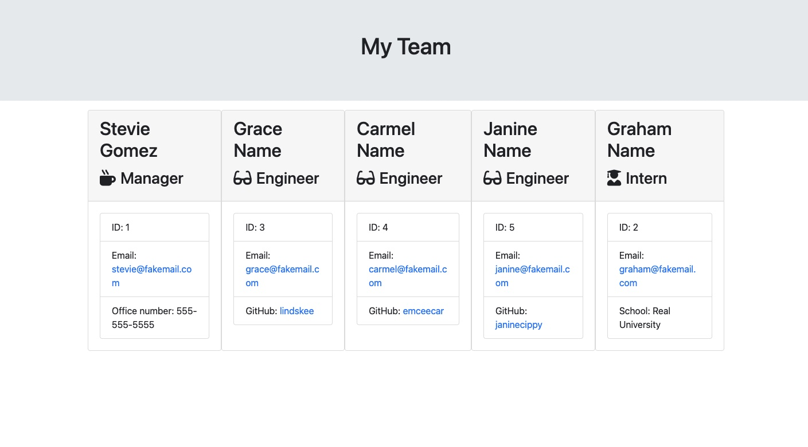

# TeamProfile-generator
  
  ## Description
  This is a command line application that allows managers to display and access team members'pertinent details and contact information.
  
  ## Table of Contents
  
  - [Installation](#installation)
  - [Usage](#usage)
  - [Credits](#credits)
  - [Contributing](#contributing)
  - [Tests](#tests)
  - [Questions](#questions)
  
  ## Installation
  Clone TeamProfile-generator repo from GitHub https://github.com/smariagomez/TeamProfile-generator and then open that repo in your code editor (e.g., VS Code). To install necessary dependencies run the following command: npm init -y. Then run the command: npm i inquirer@8.

  
  ## Usage
  Once inquirer has been installed you will run the command node index.js. Once that step has been completed you will be led through a series of prompts where you will type in the requested information for you and your team members. Every time you answer the necessary questions for a team member you will be prompted to add another member or to "Finish." When you select "Finish" the fs.writeFile function will create a teamroster.html file within the output folder.

  Walkthrough video tutorial, including Jest testing: https://drive.google.com/file/d/1lZ5w2ZAPwtAKcH67nwesrci5KplTMNd-/view
      
  ## Credits
 Web Dev Simplified YouTube tutorial https://www.youtube.com/watch?v=FgnxcUQ5vho. Jest package. Inquirer.js.
  
  ## Contributing
   Please review the [Contributor Covenant](https://www.contributor-covenant.org/) for guidlines on how to contribute to this application.
  
  ## Tests
  There are four separate tests written for this application (Employee.test.js, Engineer.test.js, Intern.test.js, Manager.test.js). Video tutorial is linked above which demonstrates how to run the tests via Jest.

  ## Questions

  If you have any questions about the repo, you can open an issue or contact me directly at: stephaniemariagomez@gmail.com. See more of my work at https://github.com/smariagomez.